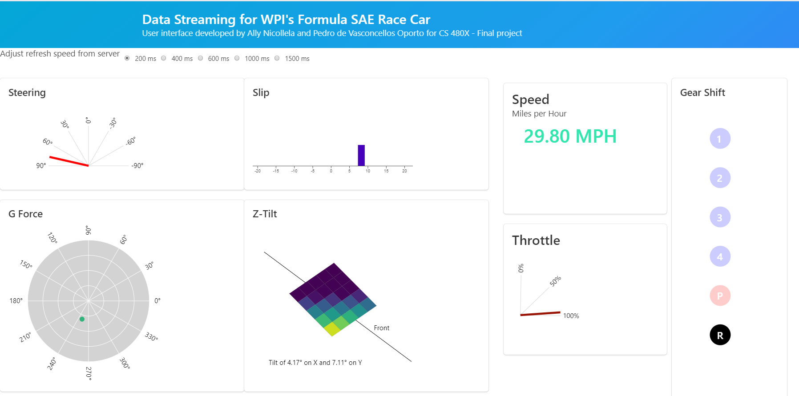

Final Project - Interactive Data Visualization  
===

Data Streaming for WPI's Formula SAE Race Car
---

Link to Project Dashboard: https://oporto.github.io/final/
This project dashboard is intended for real-time data streaming for the WPI Formula SAE Race Car. The dashboard may be used by team members in the pit in order to monitor the car and its stats remotely. The design itself was inspired by car and airplane dashboards. All graphs shown on the dashboard were developed using d3.js, with a small amount of functionality and styling provided through the use of the Bulma library. Further description of the motivation and process behind the interface design may be found in the 

Process Book: https://docs.google.com/document/d/1iH2Y2yHsEOQG3N7lB0C9bRnTuSdItufljH3GlsTF5AY/edit?usp=sharing

and video: 
https://youtu.be/0vOHl304x0A
